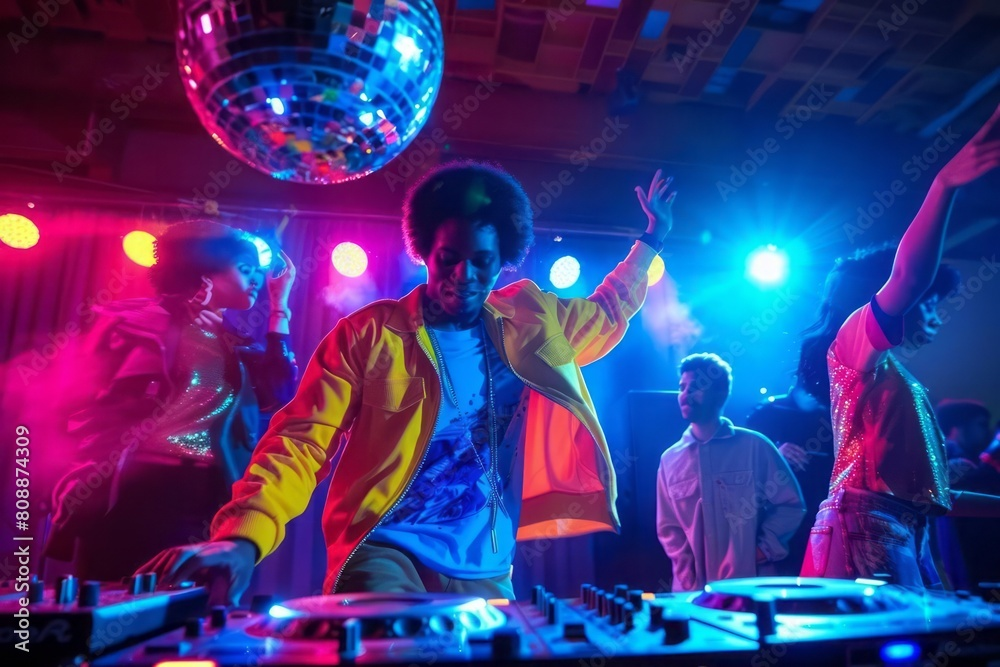

# Personas

## Diego

 - 24 years old
 - Oldest brother in family of 2 sons
 - Likes to play with technology
 - Cares a lot about his brother

## Ashley

- 23 years old
- Goes to the gym a lot and always listens to music during it
- Really likes fast paced music to match the mood of her workouts

## Ryan

- 27 years old
- Especially likes to play pop songs on the piano
- Loves songs from the 80s
- Uploads his piano recordings to YouTube

## Michael

- 30 years old
- DJs on the side
- Has a daughter in elementary school
- Loves music in general

# Scenarios

## Diego Plays Music for his Brother’s Birthday Party

Diego’s little brother’s birthday party is coming up soon. The family will host the party at their house, and Diego wants to make sure that the party goes well. His brother told Diego that he wants music during the party. Diego knows how to connect his laptop to the speakers, but he wants to have cooler party music than just playing a playlist. He’s seen videos of people getting excited in clubs when different songs mesh into each other, and he wonders if there’s an easy way to do that under the time constraints.

## Ashley Wants to Spice up her Workout Playlist

Ashley’s gym visits have been feeling a little bit stale recently, and she has come to the conclusion that some of the songs on her regular playlist are no longer quite as appealing to her after listening to them so frequently. In order to make her workouts feel fresh again, she wants to add some variation in her music while still keeping the same adrenaline-pumping vibe and without replacing her old playlist altogether. She has tried using common playlist auto-extenders like Spotify, but found that while it did play songs by similar artists, they often had different energy levels than she was used to, or otherwise played songs that she used for different playlists when not working out.

## Ryan’s Making an 80s Piano Arrangement

Ryan wants to make a new YouTube video of his piano playing. As a big fan of the 80s, he wants to play a bunch of 80s songs on the piano for the video. He knows he wants to start the video energetically with Eye of the Tiger, but he can’t really think of the next song to play afterwards. His other favorite songs don’t really match the vibe of Eye of the Tiger, so the first song just kind of ends abruptly. He begins to Google, “popular 80s songs,” but he doesn’t want to listen to each one to understand their vibe. He wonders if there’s a better way to find other songs to play alongside Eye of the Tiger.

## Michael Gets Hired for School Dance

Nelson Middle School just offered to pay Michael to handle music during the school dance. Michael has a week to come up with good songs to play. Since the kids are in middle school, he needs to make sure that there’s no explicit lyrics in the songs. He hears that kids are really into this one new song lately, so he wants to make sure to include that one. He doesn’t know of any songs that could accompany that song, however.
