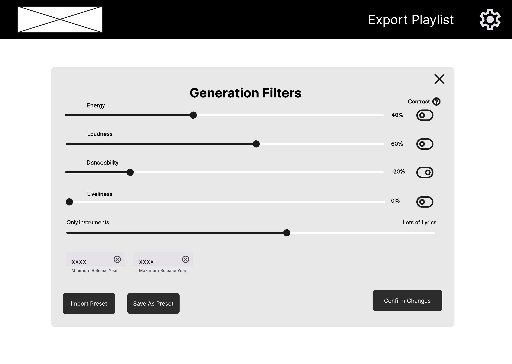

# Wireframes

## Main page with no song input

This is the main user interface of the app before a user has selected a song to match against.

## Main page with song input

This is the main user interface of the app that shows song recommendations and the user's playlist after they have selected and saved songs.

## Advanced filters menu

This is the dialog that opens when the user clicks the "Advanced filters" button.

## Main page settings drop-down

This is the drop-down menu that appears when the user clicks the gear icon in the top right.

## Helpful tooltip for contrast

This is the tooltip that appears when the user hovers over the contrast icon.

